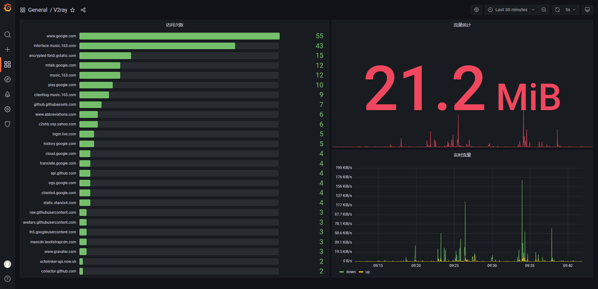
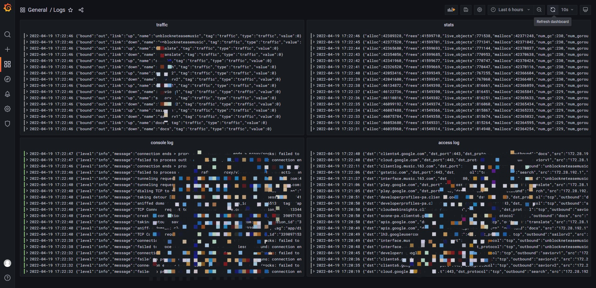

# v2ray-tracing
An example of a v2ray tracing exporter API.

## Parameters
+ `V2RAY_API`: The v2ray API address.
+ `VECTOR_ADDR`: The vector address.

## Run in Docker
```bash
docker pull xmapst/v2ray-tracing
docker run -it --rm -e V2RAY_API=localhost:1078 -e VECTOR_ADDR=localhost:9091 xmapst/v2ray-tracing
```

## V2ray config example
```json
{
  "log": {
    "access": "none",
    "error": "none",
    "loglevel": "debug"
  },
  "stats": {},
  "api": {
    "tag": "api",
    "services": [
      "HandlerService",
      "LoggerService",
      "StatsService",
      "Reflectionservice",
      "Routingservice",
      "Observatoryservice"
    ]
  },
  "policy": {
    "levels": {
      "0": {
        "handshake": 4,
        "connIdle": 300,
        "uplinkOnly": 2,
        "downlinkOnly": 5,
        "statsUserUplink": true,
        "statsUserDownlink": true,
        "bufferSize": 10240
        }
    },
    "system": {
      "statsInboundUplink": true,
      "statsInboundDownlink": true,
      "statsOutboundUplink": true,
      "statsOutboundDownlink": true
    }
  },
  "inbounds": [
    {
      "tag": "api",
      "port": 1078,
      "protocol": "dokodemo-door",
      "settings": {
        "udp": false,
        "address": "127.0.0.1",
        "allowTransparent": false
      }
    }
  ],
  "outbounds": [],
  "routing": {
    "domainStrategy": "IPOnDemand",
    "domainMatcher": "mph",
    "rules": [
      {
        "type": "field",
        "inboundTag": [
          "api"
        ],
        "outboundTag": "api"
      }
    ],
    "balancers": []
  },
  "dns": {},
  "observatory": {}
}
```

## dashboard



## Logs



## How to use

1. modify `docker-compose.yaml` and start (`docker-compose up -d`)
2. setup Grafana (add datasource)
3. import `panels/logs.json` to Grafana